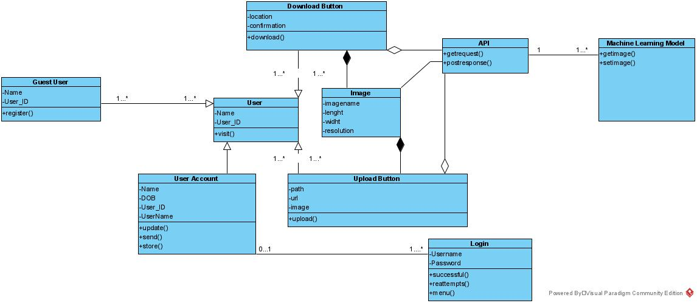
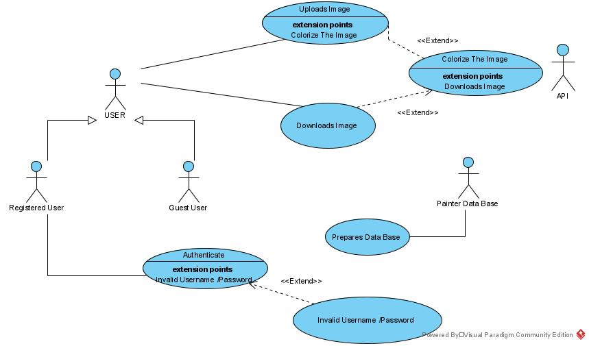
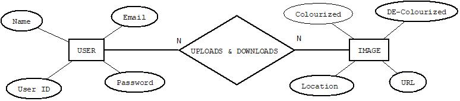
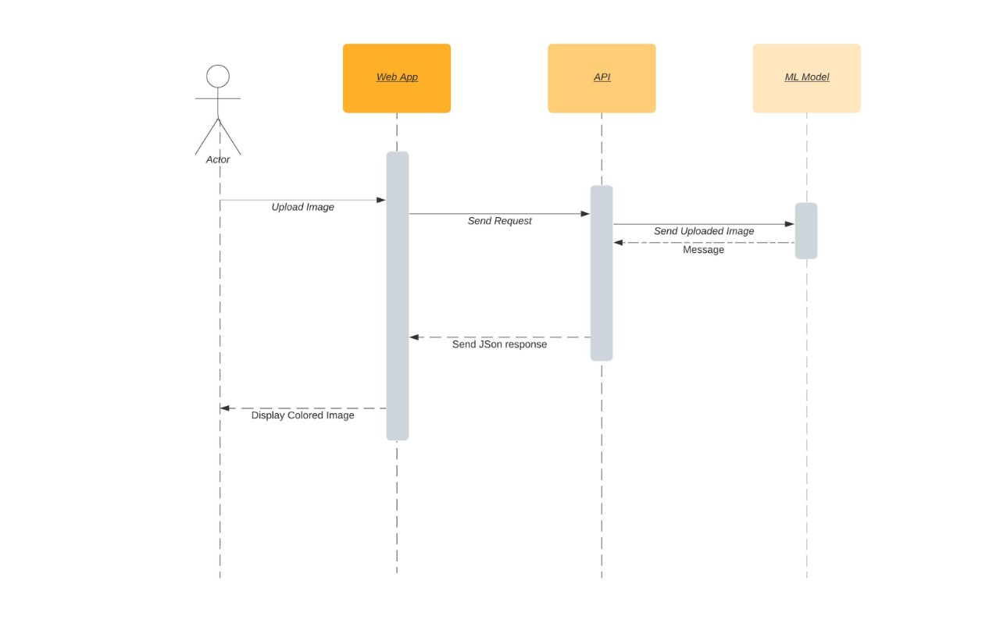

# Painter.ai:

 ## Problem Statement 

     *To develop a simple and easy to use computerized photo colorizing system
     *To develop a computerized photo colorizing system meeting the user interest in restoring old and B&W photograph for research or personal purposes
  
 ## Solution 

     *A machine learning based web application that works on API 
     *Easy to use web application that simplifies the user’s efforts of restoring or colorizing of B&W photos with one click 
     *Easy to upload image through both URL or Local storage device
  
 ## How It Works!
     *User visit the site 
     *User choses to Sign in or use the application as guest user 
     *User uploads image through URL or Local storage device 
     *Click on GO 
     *Then download the colorized image and can save it to its local storage device 
  
 ## Artifacts 
  
  ### Class Diagram 
  
  
  
  ### Activity Diagram 
  
  
  
  ### Use Case Diagrm 
  
  
  
  ### ER Diagram 
  
  
  
  ### Sequence Diagram 
  
  
  
  
  ## Conclusion 
  
  
  
 

  
 

Format: 
